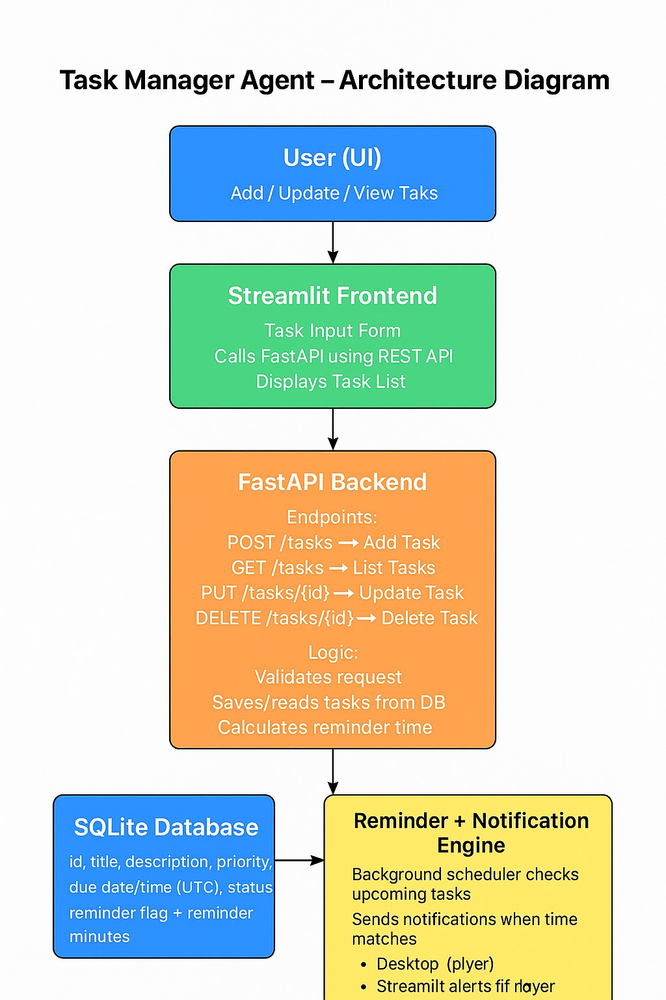

# Task Manager Agent 📝🤖

AI-powered Task Manager built with Python & Streamlit — Organizes tasks, sets reminders, and tracks productivity efficiently using modular design and AI automation.

---

## 🧩 Architecture Diagram

---

Features 🚀

- ✅ Add, update, and delete tasks effortlessly
- ⏰ Set automated reminders for tasks
- 🗃️ Local SQLite database storage for tasks
- 🤖 AI-powered suggestions for task management
- 💻 Streamlit GUI for simple and interactive usage
- 🛠️ Modular design for easy customization and scalability

---

Installation ⚡

1. Clone the repository:

git clone https://github.com/aditii-s/Task-Manager-Agent-.git

cd Task-Manager-Agent

2. Create a virtual environment (recommended):

python -m venv venv
venv\Scripts\activate   # Windows
# source venv/bin/activate  # Linux / Mac

3. Install dependencies:

pip install -r requirements.txt

4. Set up your .env file for API keys (Never commit this file!):

OPENAI_API_KEY=your_openai_api_key_here

---

Usage 🎯

Run the Streamlit GUI:

streamlit run streamlit_app.py

- 🌐 Open the URL shown in the terminal (usually http://localhost:8501)
- 📝 Add, view, or delete tasks
- ⏳ Set reminders and track your productivity

---

Contributing 🤝

1. 🔀 Fork the repository
2. 📝 Create a feature branch: git checkout -b feature/YourFeature
3. 💾 Commit your changes: git commit -m "Add new feature"
4. 📤 Push to branch: git push origin feature/YourFeature
5. ✅ Open a Pull Request

---

Notes 🔒

- 🔑 .env file contains sensitive API keys — keep it private
- 🗄️ Database (tasks.db) is auto-generated; no manual edits needed
- 🛠️ Modular design allows you to easily extend or integrate AI features

---

License 📜

MIT License © 2025
